# codex-mobile

## Introduction

I am addicted to building with Codex. The main issue with the app is that I cannot use it while away from my desktop. I built this side-project so that I can finally have Codex keep working while I'm buying groceries or watching a movie on the couch.

`codex-mobile` is a local bridge that mirrors live Codex work and exact Codex approval requests into Discord.

It runs on the same machine as Codex, watches Codex Desktop and Codex CLI at the same time, posts selected activity to Discord, and routes supported approval decisions back into Codex.

Quick notes:

- Windows-first public beta. macOS is best-effort and not yet validated with Codex Desktop (probably won't work)
- the bridge works only while your local machine and bridge process are running
- Discord is the only adapter for now
- Discord is a notification and control surface, not the source of truth
- Discord write-back is limited to the configured controller user, mapped channels, exact approval/plan actions, explicit commands, and optional plain-message write-back
- Codex Desktop sub-agent approvals can be read-only until the sub-agent chat is opened in Desktop; see [How It Looks](#how-it-looks)

## How It Looks

### Live Discord Mirror

The bot mirrors live activity from Codex. Verbosity of mirrored messages can be tuned in `bridge.config.json`.

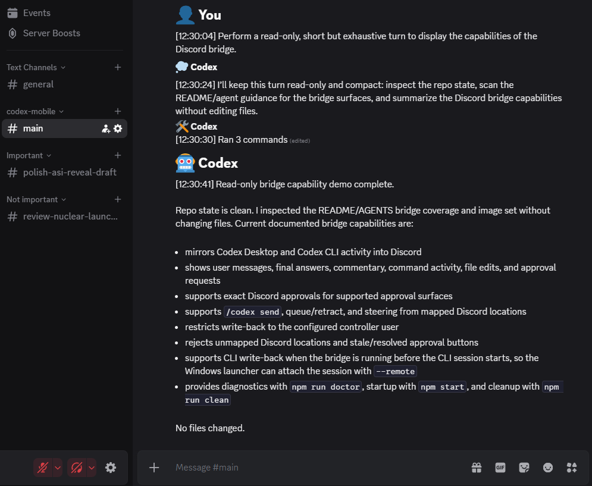

### Approval from Discord

You can approve Codex command requests directly from Discord.

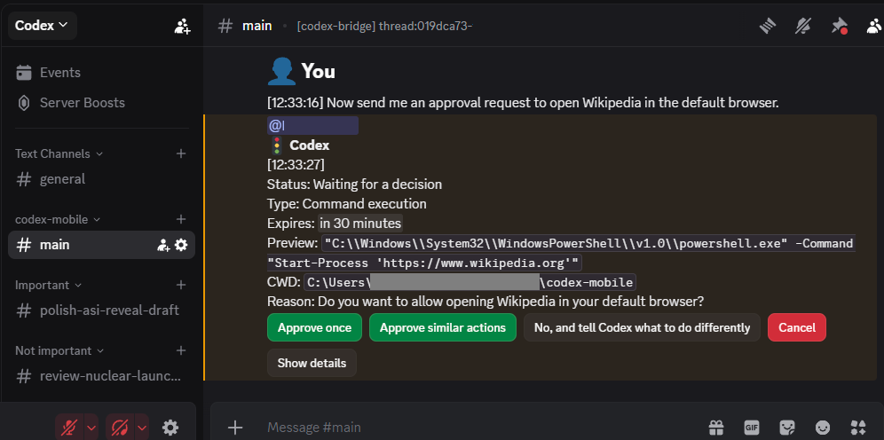

### Discord write-back to Codex

Use `/codex send`, or enable guarded plain-message write-back, to talk back to the same original Codex Desktop task from Discord. Busy tasks queue messages with steer/retract controls. `/codex model` selects the model only for future turns started from that Discord channel.

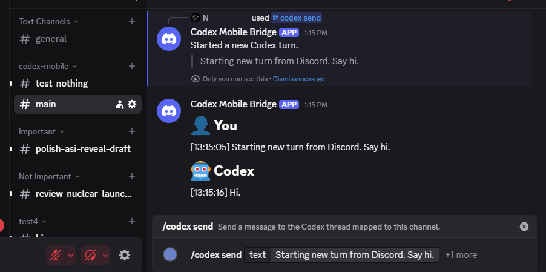

### Selective monitoring

The bridge creates a private `#监控管理` channel for the configured controller. Use `/codex manage` to open or repair it.

- New projects and conversations are discovered into the panel but default to **not monitored**.
- Enabling a project does not automatically select every conversation; select only the conversations you need.
- Stopping monitoring keeps the Discord history, changes the channel prefix to a white light, and never stops or deletes the Codex task.
- Resuming reuses the same Discord channel and continues from the current Codex state without replaying the paused interval.
- Cleaning requires a second confirmation and deletes only the stopped Discord copy and Bridge mapping. It never deletes the original Codex conversation, project, or files.
- Existing mapped conversations are selected once during the first upgrade migration so an update does not unexpectedly silence them.

## Install

### Prerequisites

- Windows, or macOS as best-effort
- Node.js 24+
- Discord account and Discord app. The setup guide uses the Windows Discord app because copying IDs and tokens is easier there, but after setup the bot works from any device where you use Discord.
- Codex Desktop (recommended) or Codex CLI already working on this machine
- A local clone of this repo on the same machine where Codex runs.

### Quick Guide

For the most guided setup, open this project in Codex and say:

```text
Help me set up this project.
```

Codex should walk you through one setup step at a time, wait for each value or confirmation, run diagnostics, and then tell you how to start the bridge yourself.

To use the terminal wizard instead:

```sh
npm install
npm run init
```

The wizard will create `.env`, create `bridge.config.json`, verify the Discord bot permissions, and run diagnostics.

Alternatively, you can manually follow the instructions below with screenshots.

### Detailed Guide

The terminal wizard and Codex-assisted setup follow this same flow.

1. Create or choose a Discord server.

   In Discord, use the `+` button in the server sidebar to create a server if you do not already have one for the bridge.

   <p>
      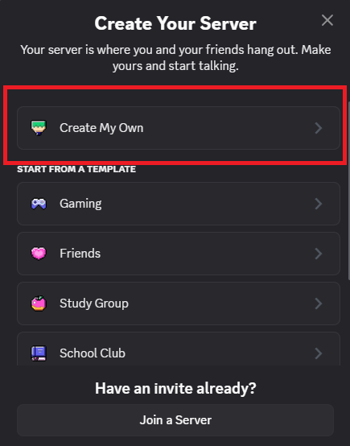
      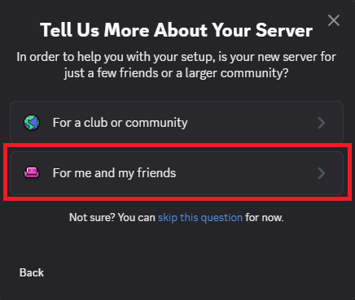
      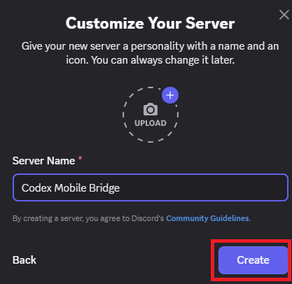
   </p>

2. Enable Developer Mode and copy the server ID.

   In Discord, turn on Developer Mode from `User Settings -> Developer -> Developer Mode`, or `User Settings -> Advanced -> Developer Mode`. Then right-click your server and copy the server ID. This value becomes `DISCORD_GUILD_ID` in `.env`.

   <p>
      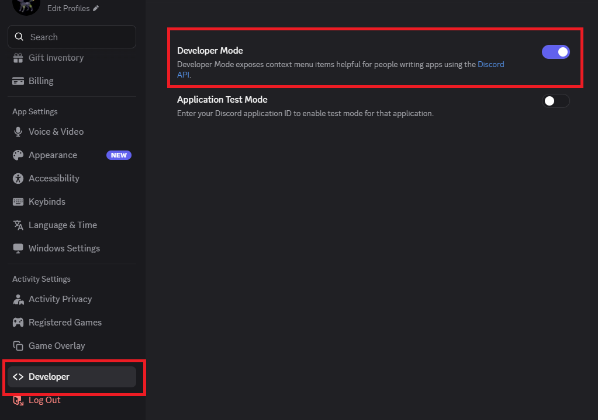
      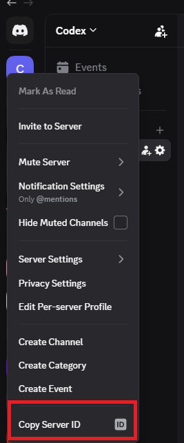
   </p>

3. Create or open the Discord application.

   Open the [Discord Developer Portal](https://discord.com/developers/applications). If Discord asks what you are building, choose `Build a Bot`. Create an application named something like `Codex Mobile Bridge`, or open your existing bridge application.

   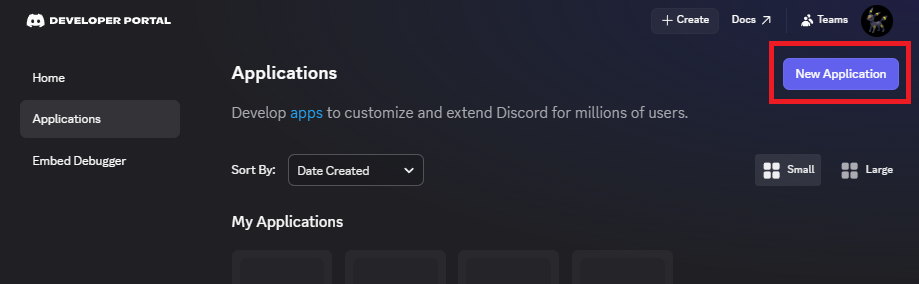
   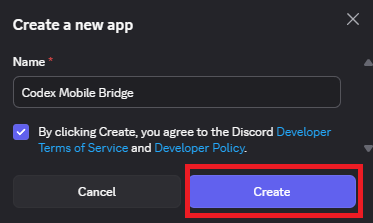

4. Copy the application ID.

   On `General Information`, copy the `Application ID`. This value becomes `DISCORD_APPLICATION_ID` in `.env`.

   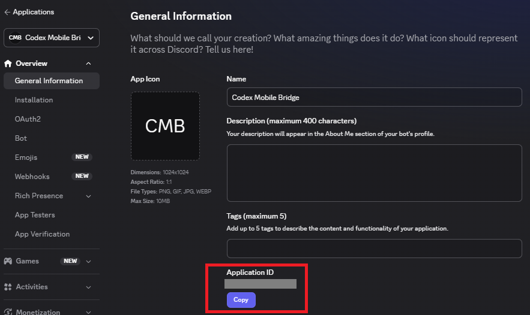

5. Create or confirm the bot.

   Open the `Bot` page in the left sidebar. Click `Add Bot` if Discord asks; if the bot already exists, continue.

   To use plain controller messages in mapped channels, also enable `Message Content Intent` under `Privileged Gateway Intents`. Slash commands and approvals do not require this optional intent.

6. Configure server install permissions.

   Open the `Installation` page. Make sure server installs are enabled.

   Required server install scopes:

   - `applications.commands`
   - `bot`

   Required bot permissions:

   - `Create Public Threads`
   - `Manage Channels`
   - `Manage Messages`
   - `Manage Threads`
   - `Pin Messages`
   - `Read Message History`
   - `Send Messages`
   - `Send Messages in Threads`
   - `View Channels`

   Keep `Requires OAuth2 Code Grant` off.

   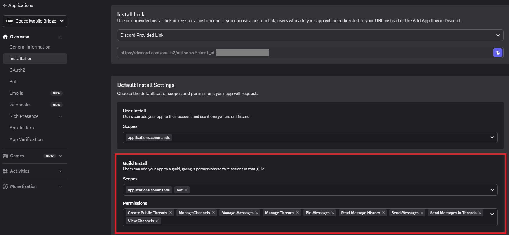

7. Copy the bot token.

   On the `Bot` page, use `Reset Token` or `Copy` to get the bot token. This value becomes `DISCORD_BOT_TOKEN` in `.env`.

   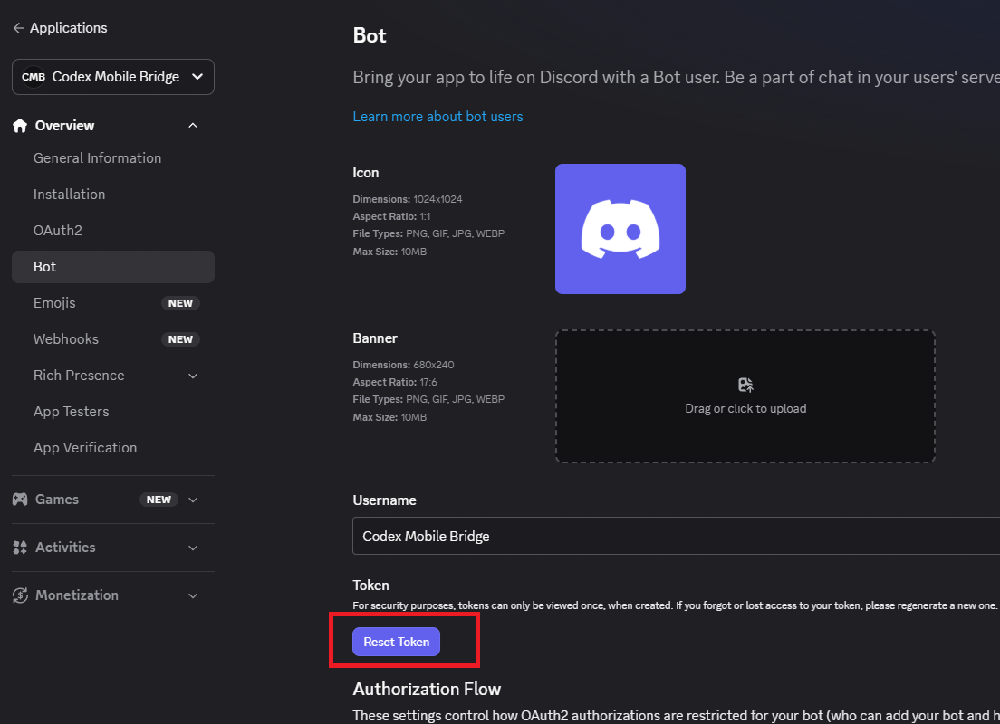

8. Invite the bot to your server.

   The wizard generates the invite URL from your application ID. If you are following the README by hand, use this format and replace `<DISCORD_APPLICATION_ID>` with your application ID:

   ```text
   https://discord.com/oauth2/authorize?client_id=<DISCORD_APPLICATION_ID>&scope=bot%20applications.commands&permissions=2252126231276560&integration_type=0
   ```

   Open the URL, choose the server you created or selected earlier, approve the requested permissions, and authorize the bot. The server ID is not part of the URL; Discord asks you to choose the server on the invite page.

   <p>
      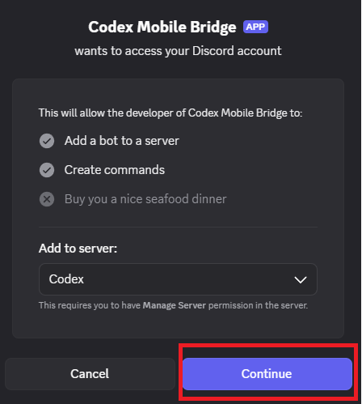
      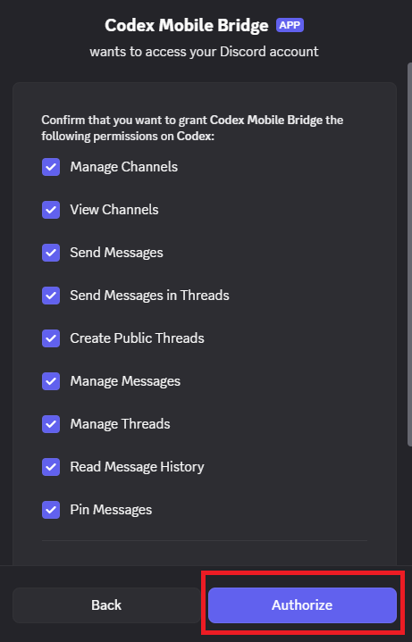
   </p>

9. Verify bot permissions.

   The wizard checks the bot's role and creates a temporary category, channel, and thread to confirm the bot can run the bridge. It removes those temporary resources afterward. If you are following the README by hand, you will verify this later with `npm run doctor`.

10. Copy the controller user ID.

    Right-click your own Discord profile and copy your user ID. This one user can approve actions and use Discord write-back in mapped channels. This value becomes `DISCORD_CONTROLLER_USER_ID` in `.env`.

    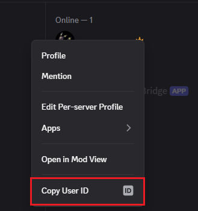

11. Choose a behavior preset.

    Use `recommended` unless you want less or more Discord output:

    - `basic`: mirrors conversation, grouped command/file activity, and approval responses, without Discord message write-back
    - `recommended`: everything in `basic`, plus `/codex send`, queue/retract, and steering write-back
    - `full`: everything in `recommended`, plus ungrouped command/file activity and detail buttons

    See [bridge.config.example.jsonc](bridge.config.example.jsonc) for an explained example of the available customization settings.
    After choosing your preset, you will save it in the next step.

12. Save `.env` and `bridge.config.json`.

    If you are using the wizard, it writes these files for you. If you are following the README by hand, create `.env` from [`.env.example`](.env.example), then fill in:

    ```env
    DISCORD_BOT_TOKEN=<bot token>
    DISCORD_APPLICATION_ID=<application ID>
    DISCORD_GUILD_ID=<server ID>
    DISCORD_CONTROLLER_USER_ID=<your Discord user ID>
    ```

    Then create `bridge.config.json` with the recommended preset:

    ```json
    {
      "preset": "recommended"
    }
    ```

    Use [bridge.config.example.jsonc](bridge.config.example.jsonc) only if you want to see all available options.

13. Run diagnostics.

    The wizard runs diagnostics automatically. You can rerun them any time:

    ```sh
    npm run doctor
    ```

    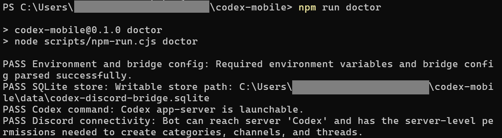

### Start The Bridge

When setup passes, start the bridge yourself:

```sh
npm start
```

If you use Codex Desktop, the recommended path is to add this project to the app, open a chat for this project, and run `npm start` there while you work in other Codex projects.

It is recommended to clean the bot's state after stopping the bridge, to avoid leaving sensitive data on discord. To clean, use `/codex cleanall` from discord, or run:

```sh
npm run clean
```

## How It Works In Practice

This is not Discord talking directly to your Codex or OpenAI account.

The actual flow is:

1. Codex Desktop or Codex CLI is already authenticated on your machine.
2. `codex-mobile` starts locally on that same machine.
3. The bridge connects to Codex locally through supported local surfaces.
4. The bridge mirrors selected activity into Discord.
5. When a supported approval appears, Discord buttons send that exact decision back through the local bridge.

### Discord

The Discord layout mirrors Codex work:

- Discord server = one bridge instance / Codex account context
- category = project or environment
- text channel = top-level Codex thread
- Discord thread = Codex sub-agent or sub-thread

The bridge can mirror final answers, thinking/commentary, user messages, command activity, file-edit activity, and approval requests. Visibility is controlled by `bridge.config.json`.

Approval and plan-response buttons work only for exact Codex requests the bridge can route back into Codex:

- Codex Desktop top-level approvals are actionable when Desktop exposes the native request.
- Codex Desktop sub-agent approvals may appear read-only until the sub-agent chat is opened in Desktop. In that state, the bridge has only a session-log placeholder and no write-back-capable request.
- Windows Codex CLI approvals are actionable when the CLI session is connected to the bridge listener. In practice, start the bridge first, then launch Codex CLI with the standard `codex` command. The Windows launcher will transparently run that CLI session with `--remote` so the bridge can route approvals and `/codex send` controls back into the live terminal. If the bridge only sees a local session log, CLI controls remain read-only.

The configured controller user can also use:

- `/codex send` to send, queue, or steer a message in a mapped Discord location
- `/codex retract` to retract the latest pending queued Discord write-back message
- `/codex model` to choose the model for future turns started from that Discord channel
- plain channel messages when `messageWriteBacks.allowPlainMessages` is enabled; these enter the same original Desktop task, queue while busy, and are not echoed back as a duplicate bot `You`

Ambient Discord chat messages are ignored by default. Plain-message write-back is opt-in and restricted to the configured controller user in mapped channels.

## Safety Model

Discord is treated as semi-trusted. The bridge keeps Codex local and fails closed when state is ambiguous.

Current rules:

- approvals are bound to exact surfaced requests only
- no arbitrary "run command from Discord" path exists
- Discord write-back works only for the configured controller in mapped bridge locations
- plain-message Desktop write-back fails closed when the original Desktop owner is unavailable; it never creates a hidden fallback task
- queued messages keep the model selected when they entered the queue, while steer actions retain the active turn model
- steering targets only a known active Codex turn
- allowlists are enforced by the local bridge
- secrets are redacted before text is posted to Discord
- detailed command views are opt-in and still redacted
- stale or resolved approval buttons are disabled
- audit entries are kept locally in SQLite

See [SECURITY.md](SECURITY.md) for security notes and reporting guidance.

## Configuration

Connection values and local IDs stay in `.env`. Behavior lives in `bridge.config.json`, generated by the init wizard. The commented reference is [bridge.config.example.jsonc](bridge.config.example.jsonc), and the preset defaults live in [config/presets](config/presets).

Important files:

- `.env`: bot token, application ID, server ID, controller user ID, Codex command, store path, log level, optional Desktop overrides
- `bridge.config.json`: behavior preset plus any local overrides
- `config/presets/*.json`: source-of-truth defaults for `basic`, `recommended`, and `full`

Behavior presets:

- `basic`: mirrors conversation, thinking/commentary, grouped command/file activity, and approval responses
- `recommended`: everything in `basic`, plus Discord message write-back for `/codex send`, queue/retract, and steering
- `full`: everything in `recommended`, but command/file activity is ungrouped with detail buttons

The preset is the base. Any sections you add below `preset` in `bridge.config.json` override that preset for your local bridge.

Useful knobs include:

- `approvals.allowFromDiscord`: command/MCP/tool approvals and proposed-plan accept/feedback
- `DISCORD_CONTROLLER_USER_ID` in `.env`: the single Discord controller user allowed to approve actions and use write-back controls
- `messageWriteBacks.allowFromDiscord`: `/codex send`, queue/retract, and steering
- `messageWriteBacks.allowPlainMessages`: opt-in controller text write-back to the same original Desktop task; requires Discord Message Content Intent
- `visibility.userMessages`
- `visibility.thinkingMessages`
- `visibility.finalMessages`
- `visibility.commands`
- `visibility.fileEdits`
- `ui.commandDisplayMode`
- `ui.enableCommandDetails`

## Commands

Common commands:

| Command                                    | Purpose                                                        |
| ------------------------------------------ | -------------------------------------------------------------- |
| `npm run init`                             | guided setup wizard                                            |
| `npm run doctor`                           | diagnostics                                                    |
| `npm start`                                | start the bridge                                               |
| `npm run dev`                              | development start                                              |
| `npm run inspect`                          | general bridge inspection                                      |
| `npm run inspect:discord`                  | inspect Discord mappings                                       |
| `npm run inspect:codex`                    | inspect Codex discovery                                        |
| `npm run inspect:desktop`                  | inspect recent Desktop approval/question events                |
| `npm run inspect:store`                    | inspect local bridge state                                     |
| `npm run inspect:thread -- <thread-id> 20` | inspect one Codex thread                                       |
| `npm run clean`                            | delete bridge-managed Discord structure and local bridge state |
| `npm run build`                            | compile                                                        |
| `npm test`                                 | run tests                                                      |
| `npm run coverage`                         | test coverage summary                                          |
| `npm run coverage:gate`                    | current coverage gate                                          |

To launch Codex CLI through the project helper:

```sh
npm run cli -- -C /path/to/workspace
```

This is optional. On Windows, setup also reconciles the standard `codex` launcher. When the bridge is already running, ordinary `codex` terminals are transparently launched with `--remote` and can receive supported approvals and `/codex send` controls from Discord. Start the bridge before starting the CLI session you want to control.

Live e2e playbooks live in [e2e-live](e2e-live). Start with:

```sh
npm run e2e-live -- groups
```

## Troubleshooting

### Unknown Server

- make sure the bot was installed into the intended server
- make sure the bot token and application ID belong to the same Discord application
- rerun `npm run doctor`

### The bot shows in Integrations but not in the member list

That can still be okay while it is offline. The real check is whether `npm run doctor` and `npm start` can connect successfully.

### Approvals appear in Codex Desktop but not in Discord

- check `npm run inspect:desktop`
- check `npm run inspect:thread -- <thread-id>`
- confirm the bridge is running on the same machine as Codex Desktop
- confirm the approval surface is one the bridge currently supports

### Sub-agent approvals are read-only in Discord

For Codex Desktop, a sub-agent approval may stay read-only until the sub-agent chat is opened in Desktop. Until Desktop exposes the native approval request, the bridge may only see a session-log placeholder, which cannot be approved from Discord.

For Codex CLI, read-only approval cards mean the bridge saw a session-log placeholder but did not receive a routable native approval request for that turn. Use the standard `codex` command on Windows while the bridge is running.

### The bridge starts but creates nothing

- run `npm run inspect:codex`
- verify Codex threads are being returned
- verify your startup/backfill behavior preset is not intentionally quiet

### Windows PowerShell shows a `CMD.EXE was started with the above path as the current directory` warning

If your PowerShell prompt shows a provider-style path such as `Microsoft.PowerShell.Core\FileSystem::\\?\C:\...`, `npm` may print a one-line `CMD.EXE` warning before the bridge starts. The repo scripts normalize back to the actual project root, so this warning is usually harmless as long as the bridge continues starting afterward.

### Discord message history looks noisy

The recommended default is the `recommended` preset. Use `basic` to disable Discord-originated messages, or `full` when you want ungrouped command/file activity.

## Public Beta Expectations

Use this release if you want:

- mobile visibility into Codex work
- Discord-based approvals for supported approval surfaces
- a local-first bridge with explicit safety controls

Do not use this release if you need:

- multi-user enterprise hardening
- fully validated macOS Desktop integration
- guaranteed support for every internal Codex approval surface
- chat-originated arbitrary control from Discord

Feedback and bug reports are welcome through GitHub Issues. External pull requests are not being accepted during the public beta; unsolicited PRs may be closed without review.

For security issues, do not open a public issue. Follow [SECURITY.md](SECURITY.md).

## Development

Run the full test suite:

```sh
npm test
```

Current layout:

- `src/bridge`: orchestration and mirror/approval logic
- `src/codex`: Codex app-server, Desktop IPC, and local session integration
- `src/providers`: provider-facing contract
- `src/providers/discord`: Discord provider entry point
- `src/discord`: current Discord implementation details

Project hygiene:

- [CONTRIBUTING.md](CONTRIBUTING.md)
- [RELEASING.md](RELEASING.md)
