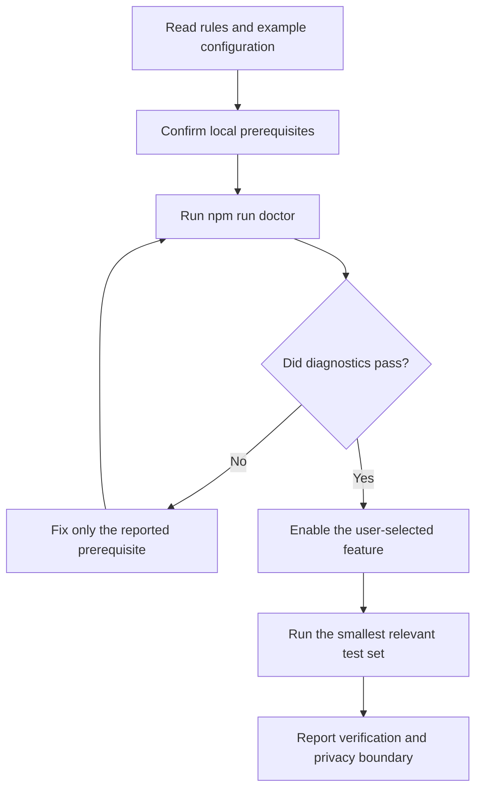

# AI Feature Implementation and Verification Runbook

> Status: ready for maintainer review. This runbook lets an AI configure, implement, and verify Codex Discord Bridge without placing real Discord content or credentials in the repository.

## Hard rules for AI assistants

1. Read root `AGENTS.md`, `README.md`, `.env.example`, and `bridge.config.example.jsonc` first.
2. Users enter secrets directly into a local `.env`; never request, echo, store, commit, or log tokens, passwords, cookies, or database content.
3. Treat Discord server IDs, user IDs, channel names, conversations, screenshots, and attachments as private data.
4. Do not start the bridge automatically. After diagnostics pass, ask the user to run `npm start` themselves.
5. Do not run `npm run clean`, delete Discord resources, clear SQLite state, commit, or push without explicit authorization.
6. Prefer local static checks. Connect to a real Discord server only when the user explicitly authorizes it.

## AI execution order



## Implementation map

| Area | Primary implementation area | State | External effect |
| --- | --- | --- | --- |
| Configuration and policy | `src/config.ts`, `src/policy/Policy.ts` | Config and allowed controller | Allows or rejects Discord operations. |
| Codex event intake | `src/bridge/events/SessionEventCoordinator.ts` | Turn, approval, plan state | Updates bridge from local Codex/Desktop events. |
| Discord mirroring | `src/providers/discord/DiscordProvider.ts` | Discord message/channel mapping | Creates or updates managed Discord content. |
| Write-back | bridge write-back coordinators and Discord provider | Queue and active-turn state | Send, queue, retract, or steer. |
| Monitoring | `src/bridge/monitoring/` | Project/task selection and pause state | Creates, pauses, resumes, or cleans mirrors. |
| Approvals | `src/bridge/approval/` | Pending approvals and expiry | Responds only to exact requests. |
| Images | `src/bridge/artifacts/InteractiveArtifactCoordinator.ts` | Local image cache | Hands supported images to Codex. |
| Local state | `src/store/` | Mappings, de-duplication, queues | Preserves necessary restart state. |

## 1. Mirror projects, tasks, and sub-tasks

1. Read project key, task ID, title, parent relationship, and activity from local Codex events.
2. Check monitor selection first. If project or task is not selected, stop without creating Discord content.
3. Ensure a category for the selected project, a channel for a top-level task, and a thread for a supported sub-task.
4. Store the `Codex task ID ↔ Discord location ID` mapping in SQLite.
5. De-duplicate stable event keys and coalesce title updates.
6. On restart, reuse only mappings that can be verified. Never guess that an arbitrary existing channel is an old task.

Verify with fictional project/task fixtures, duplicate-event replay, and Unicode titles. Never use a real server or task name as a fixture.

## 2. Mirror messages, activity, and plans

1. Normalize local user, commentary, final, command, file-edit, status, and plan events.
2. Filter by selected mapping and visibility settings.
3. Persist stable event identifiers before displaying them to prevent replay duplicates.
4. Update a live status message instead of appending transient state repeatedly.
5. Normalize plan state into current step, total steps, and summary.
6. Summarize, group, and redact command/file activity before displaying it.

Verify every event kind, repeat the same event ID, and test synthetic secret-shaped strings for redaction.

## 3. Implement status indicators

| State | Indicator | Prefix | Display |
| --- | --- | --- | --- |
| `inProgress` | 🟡 | `🟡-` | In progress, optional plan N/M. |
| `reconnecting` | 🟡 | `🟡-` | Reconnecting. |
| `waitingApproval` | 🔴 | `🔴-` | Waiting for approval plus control card. |
| `networkError`, `rateLimited`, `systemError` | 🔴 | `🔴-` | Redacted, truncated error reason. |
| `completed`, `stopped` | 🟢 | `🟢-` | Completed or stopped. |
| Monitoring paused | ⚪ | `⚪-` | Paused; no new mirror events. |

Implementation:

1. Feed turn, plan, and approval events to `TurnStatusCoordinator`.
2. Render state, optional plan progress, redacted reason, and relative timestamp with `renderTurnStatus`.
3. Update the latest commentary/final target when available; otherwise upsert a fallback status message.
4. Persist task ID, turn ID, target message, status kind, progress, and update time.
5. Use `formatDiscordChannelStatusName` so only the bridge-managed status prefix changes.
6. Coalesce and serialize channel renames; retry controlled failures rather than flooding updates.
7. Reconcile only confirmable status records at startup.
8. Apply the white paused prefix through the monitoring lifecycle coordinator.

Verify every status kind, plan 1/3 to 3/3 updates, last-write-wins rename behavior, redaction of synthetic error text, and restart behavior.

## 4. Send, Queue, Steer, and Retract

| Action | Destination | Use when | Must not do |
| --- | --- | --- | --- |
| Send | Next user turn in same task | Task idle | Insert into an active turn. |
| Queue | Local SQLite then next turn | Task active and message can wait | Interrupt active work. |
| Steer | Confirmed active turn | Current direction must change | Create a new turn or guess target. |
| Retract | Newest pending queue record | User changed their mind | Undo a delivered message. |

Implementation:

1. Validate controller, channel mapping, and write-back policy.
2. Read task active-turn state.
3. Idle task: send the next user turn in the same Codex task.
4. Active + Queue: persist task ID, order, redacted preview, time, and pending state.
5. Active + Steer: send only when active turn ID is known and valid; otherwise reject.
6. On turn completion, dequeue exactly one next message in order and mark it delivered only after submission.
7. Retract removes only the latest pending record.
8. Preserve diagnostic state on failures; do not silently lose or duplicate a message.

Verify idle send, queue delivery after completion, steer rejection without an active turn, retract behavior, and queue order across restart.

## 5. Approvals, plan feedback, and tool input

1. Receive approval, user-input, or MCP elicitation events from Desktop IPC or local session events.
2. Store request ID, task/turn IDs, allowed decisions, expiry, and a redacted preview.
3. Create a Discord card only for policy-permitted, routable requests.
4. Validate controller, pending status, expiry, and allowed decision on click.
5. Return the exact decision payload to Desktop IPC or the Codex adapter.
6. Mark decision sent, wait for local confirmation, then update the original card.
7. Reject expired, repeated, unknown, and read-only requests.

Verify each request kind with synthetic fixtures and prove that invalid users, expired tokens, duplicate clicks, and disallowed decisions cannot write back.

## 6. Selective monitoring lifecycle

1. `/codex manage` updates a private controller-only management panel.
2. Persist selected projects and tasks.
3. Check selections before creating any mirror.
4. Pause keeps necessary mapping but stops new events.
5. Resume rechecks project permission and reuses only safely identified locations.
6. Cleanup creates a short-lived confirmation token; delete only confirmed, bridge-managed content.
7. Range-check model, reasoning, and active-window settings before persistence.

Verify default non-discovery, select/pause/resume behavior, cleanup cancellation, and one stable control panel.

## 7. Images and seven-day rotation

1. Accept image URLs only from `cdn.discordapp.com` or `media.discordapp.net`.
2. Accept only PNG, JPG/JPEG, WEBP, and GIF.
3. Limit each message to four images and each image to 8 MiB.
4. Download only to the bridge-managed local image cache and pass a local reference into the same Codex task.
5. Do not store binary images in SQLite or expose absolute paths in Discord receipts.
6. `InteractiveArtifactCoordinator` removes cache files older than seven days.
7. Cleanup is restricted to the managed cache directory.

Verify source, format, count, and size rejection with mocks; verify that synthetic files older than seven days are removed and newer files remain.

## 8. SQLite retention and restart recovery

Store only mappings, monitor state, de-duplication keys, short-lived turn/approval/detail records, pending queue records, and management-panel location. Do not store tokens, cookies, full `.env`, raw image data, unlimited history, or unlimited logs.

Use atomic queue operations, bounded turn retention, expiry of controls/details, seven-day image cleanup, and restart recovery that never replays completed messages. Schema changes require explicit user approval plus migration and rollback notes.

## Minimum AI verification commands

```powershell
npm ci
npm run build
npm run check
npm test
npm run doctor
```

`npm run doctor` may be inconclusive in a restricted environment. Report that fact rather than claiming a real Discord connection passed.

## Public-release privacy cleanup

Before publication, perform read-only checks in this order:

1. Review `git status`, staged files, reachable commits, branches, and tags.
2. Confirm that `.env`, SQLite, logs, caches, media, backups, temporary files, and dependency directories are not tracked.
3. Scan source, tests, docs, and reachable history for credentials, real local paths, server/channel/user data, conversations, screenshots, and attachments.
4. Permit only fictional mockups or editable diagrams in documentation.
5. Run build, checks, and tests.
6. Report exact files, validation results, and remote target. Commit and push only after explicit authorization.

Clearing Git objects, runtime caches, or managed Discord resources is destructive and always needs separate confirmation with exact scope.

## Completion standard

A feature is complete only when its user-visible behavior matches this runbook, all write-backs target the same Codex task precisely, invalid/expired/ambiguous state fails closed, relevant checks pass, no real private material enters the repository or history, and external changes have explicit authorization.
