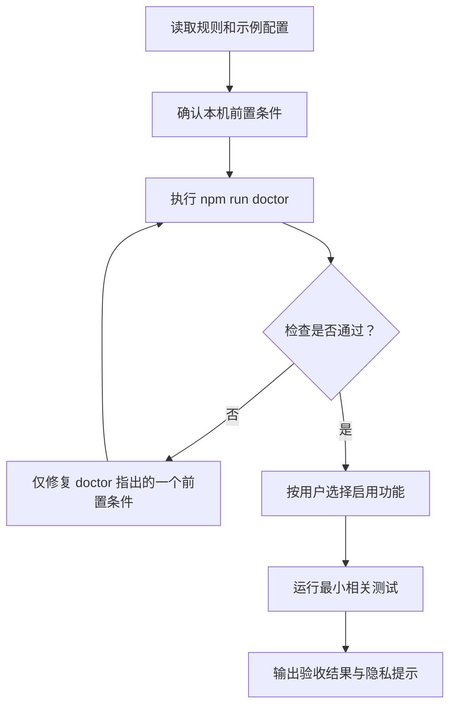

# AI 功能实施与验收手册

> 状态：待维护者审核；未提交、未推送。
>
> 用途：让 AI 助手按功能逐项检查、配置、实现或验收 Codex Discord Bridge，而不是把用户的真实 Discord 内容、密钥或聊天记录带进仓库。

## 给 AI 的硬性规则

1. 先读根目录 `AGENTS.md`、`README.md`、`.env.example` 与 `bridge.config.example.jsonc`。
2. 密钥只能由用户直接填写进本机 `.env`；AI 不得索要、回显、写入、提交或记录令牌、密码、Cookie、数据库内容。
3. Discord 服务器 ID、用户 ID、频道名称、聊天记录、截图和附件均按私密数据处理；不要放入示例、测试快照或文档。
4. 不自动启动桥接。配置检查通过后，提示用户自行运行 `npm start`。
5. 未得到明确授权，不运行 `npm run clean`，不删除 Discord 频道/分类，也不清空 SQLite 状态。
6. 未得到明确授权，不提交、不推送，不执行 Discord 侧创建或删除操作。
7. 每项工作先做最小静态检查；只有用户明确要求连接真实 Discord 时，才进行受限的真实环境验证。

## AI 的工作顺序



AI 不应跳过 `doctor` 直接猜测配置；也不应为了“验证”而读取 `.env` 的真实值。

## 功能总览与代码边界

| 功能域 | 主要实现位置 | 持久化/状态 | 对外动作 |
| --- | --- | --- | --- |
| 配置与权限 | `src/config.ts`、`src/bridge/Policy.ts` | 配置文件、允许控制者 | 启用或拒绝 Discord 操作。 |
| Codex 事件接入 | `src/bridge/events/SessionEventCoordinator.ts` | 回合、审批、计划状态 | 从本机 Codex/桌面事件更新桥接。 |
| Discord 镜像 | `src/providers/discord/DiscordProvider.ts` | Discord 消息/频道映射 | 创建或更新受管 Discord 内容。 |
| 原任务写回 | `src/bridge/*WriteBack*`、`src/providers/discord/DiscordProvider.ts` | 队列项、活动回合状态 | 发送、排队、撤回或 steering。 |
| 选择性监控 | `src/bridge/monitoring/` | 项目/任务选择、暂停状态 | 建立、暂停、恢复、清理镜像。 |
| 审批与问题 | `src/bridge/approval/`、`src/bridge/events/SessionEventCoordinator.ts` | 待处理审批、过期时间 | 仅响应精确的待处理请求。 |
| 图片传递 | `src/bridge/artifacts/InteractiveArtifactCoordinator.ts` | 本地图片缓存 | 将允许的 Discord 图片交给 Codex。 |
| 本地状态 | `src/state/`、SQLite provider | 映射、去重、队列、短期记录 | 重启后恢复必要关联。 |

文件名用于引导 AI 定位实现；重构后应优先按职责搜索，而不是机械依赖单个文件路径。

## 1. 项目、任务和子任务镜像

### 目标

把用户选择的 Codex 项目映射为 Discord 分类，把顶层 Codex 任务映射为频道，把可支持的子任务映射为频道线程。

### 实现拆解

1. 从 Codex 本地事件取得项目键、任务 ID、标题、父任务关系和活动状态。
2. 查询选择性监控状态；项目或任务未被选择时停止在这里，不创建 Discord 内容。
3. 为已选择项目确保分类存在，为顶层任务确保频道存在，为子任务确保线程存在。
4. 在 SQLite 记录 `Codex task ID ↔ Discord channel/thread ID` 映射。
5. 对相同事件键做去重；标题更新做合并，避免重复消息和频繁改名。
6. 重启时读取映射并核对 Discord 侧资源；无法确认时显示受控错误，不把新频道猜作旧任务。

### AI 验收

- 用虚构项目和任务名运行本地 provider 或单元测试。
- 验证未被选择的项目不会被创建或发现。
- 验证同一事件重放不会产生第二条镜像。
- 验证中文、日文或 emoji 标题不会被破坏。

### 禁止事项

- 不用真实服务器名称、频道截图或历史任务作为测试夹具。
- 不通过“扫描全部 Discord 频道”猜测映射。

## 2. 消息、状态和计划进度镜像

### 目标

将 Codex 的用户消息、commentary、最终回答、命令/文件活动、回合状态和计划进度投射到对应 Discord 位置。

### 实现拆解

1. `SessionEventCoordinator` 接收并归一化本机 Codex 事件。
2. 依据任务映射和可见性配置过滤事件。
3. 用稳定事件标识写入状态库，避免重连或轮询导致重复回显。
4. 将进行中状态写成可更新的 Discord 状态消息；结束、失败或暂停时更新同一状态，而非持续追加噪声。
5. 将计划步骤归一化为“当前步骤/总步骤/摘要”，更新任务状态消息。
6. 命令和文件活动按配置做摘要、分组与敏感模式脱敏后再显示。

### AI 验收

- 给本地测试 provider 输入 user、commentary、final、command、file edit 和 plan 事件。
- 断言每类事件进入正确频道/线程，且状态消息可被更新。
- 对同一 event ID 重放两次，断言只保留一个展示结果。
- 用含假密钥格式的文本测试脱敏；测试值必须是合成值，不能像真实可用凭据。

### 配置决策

- 需要更少暴露：使用 `basic` 或降低 `visibility`。
- 需要命令/文件活动：使用 `recommended` 或 `full`，并先阅读 `SECURITY.md`。

## 3. 状态指示灯

### 目标

让 Discord 频道名称和最近的状态文本直观反映 Codex 任务当前是否在运行、等待授权、出现错误、已结束或被暂停监控。

### 状态契约

| Codex/桥接状态 | 指示灯 | 频道名前缀 | 状态文本 |
| --- | --- | --- | --- |
| `inProgress` | 🟡 | `🟡-` | 进行中，可带“第 N/M 步”。 |
| `reconnecting` | 🟡 | `🟡-` | 正在重连。 |
| `waitingApproval` | 🔴 | `🔴-` | 等待授权，并显示受控审批卡片。 |
| `networkError`、`rateLimited`、`systemError` | 🔴 | `🔴-` | 错误类别和经过脱敏、截断的原因。 |
| `completed`、`stopped` | 🟢 | `🟢-` | 已完成或已停止。 |
| 监控暂停 | ⚪ | `⚪-` | 已暂停；后续事件不再镜像。 |

### 实现拆解

1. 回合、计划和审批事件进入 `TurnStatusCoordinator`。
2. 使用 `renderTurnStatus` 把状态、可选计划进度、已脱敏原因和相对更新时间渲染为 Discord 文本。
3. 优先把状态后缀更新到该回合最近的 commentary/最终回答；没有目标消息才创建或更新单独的 fallback 状态消息。
4. 将状态记录写入 SQLite，包含任务 ID、回合 ID、目标消息、状态种类、进度和更新时间。
5. 使用 `formatDiscordChannelStatusName` 生成带灯号的频道名称；只替换桥接自己的状态前缀，不破坏用户标题中的 Unicode 字符。
6. 对频道改名做短暂合并和串行化；瞬时高频事件只保留最新状态，失败后按受控间隔重试。
7. 启动时调用状态协调器重新对齐仍可确认的进行中、完成或终态记录；不凭空把未知任务标为“进行中”。
8. 暂停监控时由监控生命周期协调器写入 `⚪-` 前缀并停止后续状态投射。

### AI 验收

- 输入每种 `TurnStatusKind`，断言得到正确颜色、中文标签和频道前缀。
- 计划从 1/3 更新到 3/3，断言同一状态消息被更新而不是重复创建。
- 连续发送多个状态，断言频道最终只采用最后一个有效前缀。
- 使用含合成敏感模式的错误原因，断言显示文本已脱敏且长度受限。
- 模拟重启，断言仍可确认的状态被恢复，未知状态不被伪造。

## 4. 发送、Queue、Steer 与 Retract

### 概念边界

| 动作 | 写入位置 | 什么时候使用 | 不做什么 |
| --- | --- | --- | --- |
| Send | 同一原始 Codex 任务的新用户回合 | 任务空闲 | 不会插入正在运行的回合。 |
| Queue | 本地 SQLite，随后成为下一用户回合 | 任务运行中但信息可等待 | 不会中断当前任务。 |
| Steer | 已确认的活动 Codex 回合 | 需要改变当前工作方向 | 不会新建回合或猜测活动目标。 |
| Retract | 删除最新未发送队列项 | 用户改变主意 | 不会撤销已提交给 Codex 的内容。 |

### 实现拆解

1. 收到 `/codex send` 或允许的普通消息后，先验证 Discord 用户、频道映射和写回策略。
2. 查询该 Codex 任务的活动回合状态。
3. 空闲时：调用 Codex 适配层，在同一任务创建下一用户回合。
4. 运行中且模式为 `queue`：生成队列记录，保存任务 ID、排序、脱敏预览、创建时间和状态。
5. 运行中且模式为 `steer`：只有活动回合 ID 明确且仍有效时，调用 Codex steering 接口；否则返回明确拒绝原因。
6. 当前回合终结事件到达后，按顺序提取一条队列记录，标记为已发送，再提交为下一用户回合。
7. `/codex retract` 只允许取消最新的 `pending` 队列项。
8. 任何提交失败都保留可诊断状态，不能静默丢消息或重复发送。

### AI 验收

- 空闲任务：验证 Send 产生“下一回合”调用。
- 活动任务 + Queue：验证先落库，回合结束后只发送一次。
- 活动任务 + Steer：验证只对已知活动回合调用 steering。
- 无活动回合：验证 Steer 被拒绝且不发送消息。
- Retract：验证只移除最新待发送项，不影响已发送项。
- 重启模拟：验证待发送队列顺序保持不变。

### 安全门槛

- 默认仅一个 `DISCORD_CONTROLLER_USER_ID` 可发起写回。
- 仅已桥接频道可写回。
- 不支持把 Discord 变成任意 shell 或文件系统入口。

## 5. 审批、计划反馈和工具输入

### 目标

当 Codex 公开一个可路由的待处理请求时，在 Discord 显示精确的卡片/按钮，并且只把允许的决策回复给原请求。

### 实现拆解

1. 从 Desktop IPC 或本地会话事件接收审批、用户输入或 MCP elicitation 请求。
2. 建立待处理记录：请求 ID、任务 ID、回合 ID、允许决策、创建时间、过期时间和已脱敏预览。
3. 只有策略允许且请求可路由时才创建 Discord 交互卡片。
4. 点击操作先校验控制者、请求状态、过期时间和允许决策。
5. 将对应 payload 发送回 Codex Desktop IPC 或 Codex 适配层。
6. 记录决策已发送，等待本机事件确认最终状态，随后更新原卡片。
7. 过期、重复、未知或只读请求必须拒绝，不猜测对应的审批。

### AI 验收

- 对 command/file/user-input/MCP 请求分别使用合成事件夹具。
- 验证非法用户、过期 token、重复点击和不允许的决策都无法写回。
- 验证 Desktop 未暴露原生可路由请求时，Discord 只展示只读状态。

## 6. 选择性监控、暂停、恢复和清理

### 目标

让用户明确选择哪些项目/任务会出现在 Discord，并可安全管理其生命周期。

### 实现拆解

1. `/codex manage` 创建或更新只对控制者可见的私有管理面板。
2. 选择项目后，持久化项目监控状态；选择任务后，持久化任务监控状态。
3. 事件协调器在创建 Discord 镜像前查询这些选择状态。
4. 暂停时保留必要映射和原 Discord 频道 ID，但停止新的镜像事件。
5. 恢复时重新校验项目仍被允许，再复用可安全确认的频道并继续状态更新。
6. 清理前创建一次性确认令牌；仅确认后才删除桥接管理的 Discord 内容及对应状态。
7. 默认模型、推理级别和活跃窗口等控制项必须有范围校验并写入本地状态。

### AI 验收

- 默认情况下，新发现任务不应被镜像。
- 选择后出现；暂停后停止；恢复后继续。
- 清理取消时无删除；确认时只删除桥接管理资源。
- 面板重复打开不会产生多个控制面板或权限漂移。

## 7. Discord 图片传给 Codex 与 7 天轮转

### 目标

允许控制者在受管频道发送少量图片给同一 Codex 任务，同时限制来源、大小和本地缓存寿命。

### 实现拆解

1. 只接受来自 `cdn.discordapp.com` 或 `media.discordapp.net` 的附件 URL。
2. 只接受 `png`、`jpg`、`jpeg`、`webp`、`gif` 格式。
3. 每条 Discord 消息最多下载 4 张图片；每张最多 8 MiB。
4. 下载到桥接管理的本地图片缓存目录，生成没有敏感展示内容的内部元数据。
5. 将本地图片引用交给同一 Codex 任务；发送失败时清晰报告，不把二进制内容写进 SQLite。
6. `InteractiveArtifactCoordinator` 在运行期间清理超过 7 天的缓存文件。
7. 清理只匹配桥接管理的缓存目录和过期文件，不能触及用户其他图片目录。

### AI 验收

- 用本地 mock URL/响应测试域名、扩展名、数量和大小限制。
- 测试 7 天前的合成缓存文件被删除，7 天内文件保留。
- 验证非 Discord CDN、超限数量或超限大小被拒绝。
- 日志和 Discord 回执不得包含本机绝对图片路径。

## 8. SQLite 状态、保留与重启恢复

### 目标

保存桥接运行所必需的少量状态，同时控制增长并让过期控制自动失效。

### 应保存的最小数据

- Codex 任务与 Discord 频道/线程映射；
- 监控选择、暂停状态和受管资源标识；
- 去重键和必要的回合状态；
- 待处理审批及其过期时间；
- 尚未发送的队列消息；
- 必要的控制面板定位信息。

### 不应保存的数据

- Discord bot token、密码、Cookie 或完整 `.env`；
- 原始图片二进制；
- 无限制的历史对话、命令输出或完整日志；
- 无边界增长的已完成审批和过期队列。

### 实现拆解与验收

1. 每次读写按任务/记录主键进行，使用事务或等效原子操作保护队列顺序。
2. 回合记录使用配置的有限保留数量；默认只保留很短的近期回合。
3. 审批和详情记录到期后不可操作，并由保留逻辑清理。
4. 图片缓存按 7 天轮转。
5. 重启后仅恢复映射、待处理队列和仍有效控制状态；不自动重放已完成消息。
6. AI 修改 schema 前必须先请求用户确认，并编写迁移与回滚说明。

## AI 的最小验证命令

在不接触真实 Discord 内容的情况下，AI 应优先运行：

```powershell
npm ci
npm run build
npm run check
npm test
npm run doctor
```

说明：`npm run doctor` 可能需要用户本机正常网络和本地配置。受限环境中它无法连接 Discord 时，应报告“无法判定”，而不是伪造通过结果。

## AI 的公开发布清理流程

AI 在维护者确认发布前，必须按以下顺序执行只读检查；发现问题时先报告，不自行删除或推送：

1. **确认范围**：公开仓库只含可发布源代码、测试、示例配置、许可证、来源归属和文档。
2. **检查工作树与可达历史**：检查 `git status`、待推送 commit、分支与标签，避免只看当前目录遗漏历史内容。
3. **检查敏感与运行产物**：确认 `.env`、SQLite、日志、缓存、图片、备份、临时文件和依赖目录未被跟踪。
4. **检查文档与图片**：确认没有真实 Discord 截图、服务器/频道/用户信息、对话、机器路径、ID 或密钥；只保留 Mermaid 图或已审查的虚构示意图。
5. **运行验证**：执行构建、检查和测试；`doctor` 的真实连接结论仅在用户授权的环境中报告。
6. **请求发布确认**：报告将提交的文件、测试结果、远程地址与任何未决风险；得到明确确认后才 commit/push。

如果需要清理不可达的本地 Git 对象、删除缓存或执行 `npm run clean`，AI 必须先说明精确目标和影响并取得单独授权。这些动作不能被“发布前清理”自动化替代。

## AI 输出模板

每次完成一项工作后，AI 使用如下结构向用户汇报：

```text
功能：<功能名称>
做了什么：<精确改动或配置>
验证：<实际运行的命令和结果>
未做什么：<因安全/授权而没有执行的外部动作>
隐私：未读取或输出任何密钥、真实聊天记录、服务器信息或图片。
```

## 用户授权点

AI 必须单独取得确认后才能执行：

| 操作 | 为什么需要确认 |
| --- | --- |
| 启动桥接 | 会连接真实 Discord 并产生外部活动。 |
| 创建/删除 Discord 分类、频道、线程 | 会修改用户服务器。 |
| 启用远程审批、写回或完整可见性 | 会扩大 Discord 侧可见内容或控制能力。 |
| 运行 `npm run clean` | 会删除桥接管理的 Discord 结构和本地状态。 |
| 改 SQLite schema | 可能影响既有状态与升级路径。 |
| Git commit/push | 会改变公开历史或向外发布内容。 |

## 完成标准

一项功能只有同时满足下列条件才算完成：

1. 用户可见行为与本文对应功能定义一致；
2. 所有写回都能精确定位同一个 Codex 任务；
3. 权限、映射、过期和失败路径均为拒绝优先；
4. 通过直接相关的构建、检查和测试；
5. 没有将真实 Discord 内容或密钥加入代码、文档、测试或 Git 历史；
6. 外部动作和公开发布均获得用户明确授权。
