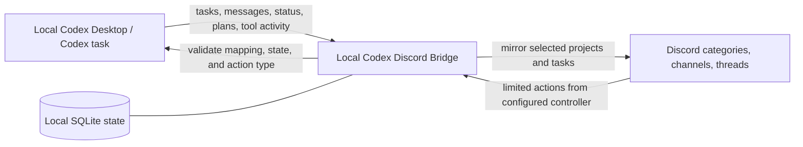
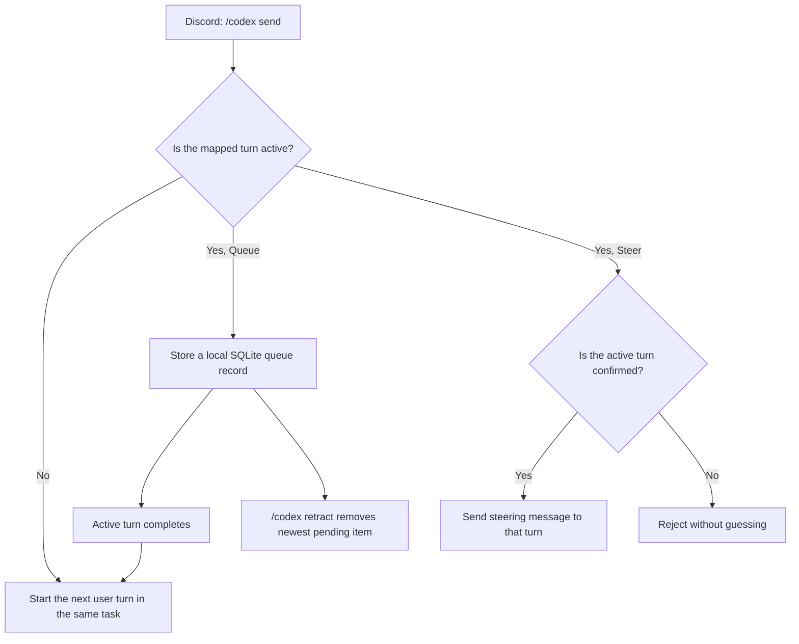

# Codex ↔ Discord Capability Archive (Public v1 Draft)

> Status: ready for maintainer review. This document contains no real Discord server, channel, user, conversation, image, log, path, or credential.

For an AI-operated implementation and verification procedure, see the [AI implementation runbook](ai-feature-implementation-runbook.md).

## In one sentence

Codex Discord Bridge is a local, controlled bridge that projects selected Codex projects and task activity to Discord, then routes a small set of validated Discord actions back to the **same** Codex task.

Codex remains the source of truth and execution environment. Discord is a constrained notification and control surface, not a second Codex client with arbitrary access.

## Origin and extension

The upstream original established the Codex-to-Discord activity synchronization foundation. This independently maintained version extends that foundation with guarded Discord-to-Codex dialogue for the same mapped task: an authorized controller can send a new task message, queue a next-turn message, or steer a confirmed active turn so Codex can continue the conversation and modify the project.

## What “sync” means

| Category | Meaning |
| --- | --- |
| **Mirrored** | Activity that already happened in Codex is displayed in Discord. |
| **Controlled interaction** | Discord may perform an explicit, validated action on a mapped Codex task. |
| **Boundary/read-only** | For safety or platform limits, Discord only displays state or the action is unsupported. |

## Architecture

SQLite holds only bridge mappings, monitor selections, queued messages, and short-lived interaction state needed to survive restarts. It does not make Discord the source of Codex state.

## Codex surface to Discord surface

### Project, task, and sub-task hierarchy

| Codex object | Discord presentation | Category | Notes |
| --- | --- | --- | --- |
| Project/workspace | Category | Mirrored | Only explicitly selected projects are shown. |
| Top-level task/conversation | Channel | Mirrored + controlled interaction | One mapped channel refers to one original Codex task. |
| Supported sub-agent/sub-task | Channel thread | Mirrored | Retains the task hierarchy. |
| Task title and status | Channel name and status message | Mirrored | Title changes are coalesced to avoid noisy renames. |

### Live activity

The bridge can display user messages, commentary, final answers, command summaries, file edits, turn lifecycle, plan progress, and supported approvals or tool-input requests in the mapped Discord location. The original content and execution remain on the local Codex machine.

### Status indicators

Each mapped top-level task channel uses a status prefix and a live status message. It is driven by Codex turn, plan, approval, and restart-reconciliation events, not by an inferred “online” signal.

| Indicator | Channel prefix | Meaning | Discord presentation |
| --- | --- | --- | --- |
| 🟡 | `🟡-task-name` | In progress or reconnecting | Shows in-progress/reconnecting state and optional plan step. |
| 🔴 | `🔴-task-name` | Awaiting approval, network error, rate limit, or system error | Shows a redacted reason; an approval card is shown when applicable. |
| 🟢 | `🟢-task-name` | Completed or stopped | Preserves the terminal state for quick mobile review. |
| ⚪ | `⚪-task-name` | Monitoring paused | Stops future mirroring until resumed. |

Status text is attached to the latest commentary or final answer when possible, otherwise a dedicated status message is updated. Channel renames are coalesced, and only confirmable state is reconciled after restart.

### Selective monitoring lifecycle

| Feature | Discord action/presentation | Category |
| --- | --- | --- |
| Choose projects and tasks | Private `/codex manage` panel | Controlled interaction |
| No automatic discovery by default | Only selected scope starts mirroring | Safety boundary |
| Pause | Preserve mapping and stop new activity | Controlled interaction |
| Resume | Continue future activity for the task | Controlled interaction |
| Cleanup | Remove the Discord mirror after confirmation | Controlled interaction |
| Restart recovery | Rebuild necessary mappings and controls from local state | Reliability |

## Writing back to Codex: Send, Queue, Steer

All write-backs target the mapped original Codex task. The bridge does not substitute an unrelated or ambiguous new conversation.

### `/codex send`

When the target task is idle, `/codex send` starts the next user turn in that same original Codex task.

### Queue

When a Codex turn is active, choosing **Queue** stores the message in local SQLite. After the active turn ends, the bridge sends it as the next user turn in order. `/codex retract` removes the newest still-pending queued message.

Queue is an ordered next-turn message. It does **not** interrupt the active Codex turn.

### Steer

When the bridge has confirmed an active turn for the mapped task, **Steer** writes a steering message into that active turn so Codex can adjust its current work. It is neither a new turn nor an arbitrary task termination. If the active turn cannot be confirmed, the bridge rejects the action instead of guessing.

| Discord control | Codex capability | Constraint |
| --- | --- | --- |
| `/codex send` | Next user message in the same task | Mapped channel only. |
| Queue | Ordered next user turn | Sent only after the active turn ends. |
| Steer | Live steering of an active turn | Requires a confirmed active turn. |
| `/codex retract` | Cancel newest pending queue item | Does not undo a delivered message. |
| `/codex model` | Select model/reasoning for subsequent turns | Limited by bridge configuration and Codex availability. |
| Optional plain message | Controlled send entry point | One configured controller by default. |
| Approval/plan controls | Respond to surfaced Codex requests | Exact, pending, and non-expired requests only. |

### Everyday use: model, interrupt, queue, and retract

These controls apply only to the Codex task mapped to the current Discord channel. They do not change the model of a running turn or send content to another task.

| Goal | Discord action | What the bridge does | Limit |
| --- | --- | --- | --- |
| Choose a model for later turns | Run `/codex model`, choose a model privately, then choose reasoning effort if offered. Choose the Codex default to clear the channel preference. | Saves a local per-channel model/reasoning preference and attaches it to the next Discord-originated **new turn**. | A running turn is unchanged; only currently available Codex models and supported reasoning levels are selectable. |
| Continue after current work | Use `/codex send` with `queue`, or the Queue control. | Stores the message locally, then submits it in FIFO order as the next user turn for the same task. | At most 10 pending messages per task; delivered messages cannot be retracted. |
| Change the current direction now | Use `/codex send` with `steer`, or the Steer control. | Sends a steering message to a confirmed active turn. | It is neither a new turn nor forced cancellation; ambiguous, stale, or idle turns are rejected. |
| Remove newest unsent message | Run `/codex retract`. | Removes the newest local `pending` queue record. | Does not affect sent, sending, or older entries. |

Use **Queue** for the next task and **Steer** only when the current direction must change now. Steering depends on current Codex turn, Desktop IPC, and local event state; the bridge refuses rather than guessing an active target.

### Why status indicators can lag

Indicators show task state, not a Discord online signal. Codex must first emit a turn, plan, approval, completion, stop, or error event. The bridge then updates local state and status text; channel-name prefixes are coalesced and serialized to avoid rename limits and stale updates overwriting newer state. Text can therefore update before the prefix, and reconnects restore only confirmable state.

🟡 means active or reconnecting state was observed; 🔴 means approval required or an error was observed; 🟢 means completion or stop was confirmed; ⚪ means monitoring is paused. A delayed indicator does not mean Discord can directly cancel the local task.

## Capabilities included in public v1

1. Write-back to the original Codex task.
2. Persistent turn lifecycle status and commentary status suffixes.
3. Plan-progress mirroring.
4. Selective monitoring with private management controls.
5. Pause, resume, and confirmation-gated cleanup of mirrors.
6. Supported sub-agent activity in Discord threads.
7. Unicode-safe project and channel names.
8. Event de-duplication and restart/reconnect/title-update coordination.
9. Controlled Discord-image handoff to Codex.
10. Image guardrails: official Discord CDN, supported formats, at most four images per message, at most 8 MiB each.
11. Seven-day rotation of local Discord image cache.
12. Bounded retention for turns, approvals, details, and other short-lived SQLite state.
13. Channel and message status indicators for in-progress, approval/error, complete/stopped, and paused states.

## Intentional limits

- Discord is not a local shell and cannot execute arbitrary commands.
- Arbitrary Discord users cannot control Codex; controller, location, task mapping, expiry, and action type must match.
- The bridge does not mirror all local projects, history, or sub-tasks by default.
- Some Desktop sub-agent approvals can be visible but read-only until Desktop exposes a native routable request.
- The bridge maps safe, exposed Codex surfaces; it does not promise to reproduce every internal Codex interface.

## Privacy-safe visual documentation

Do not publish real Discord screenshots. Redaction can miss server names, channel structure, avatars, timestamps, file names, notification fragments, or image metadata.

For v1, use the Mermaid diagrams in this document. If visual assets are later needed, create fictional mockups only and label them “Illustrative mockup — not a live Discord screenshot.” Use names such as `sample-web`, `Improve search`, and `Controller`; never use real IDs, users, servers, images, or paths. Review generated assets with a static privacy scan before publishing.

## Public v1 cleanup and release order

1. Keep the private development backup outside the public repository.
2. Build a clean public worktree containing source, tests, example configuration, license, attribution, and public documentation only.
3. Review reachable Git branches, tags, and commits, not just the current files.
4. Scan for credentials, ignored runtime files, media, logs, caches, databases, backups, and oversized objects without printing any suspected secret.
5. Ensure documentation and visuals contain only fictional material or editable diagrams.
6. Run build, static checks, and tests. Use real Discord validation only in an authorized private server.
7. Recheck the exact staged file list and remote target, then commit and push only after maintainer approval.

## Recommended public description

> Codex Discord Bridge mirrors selected live Codex task activity to Discord and routes a small, explicit set of validated controls back to the same local Codex task. It supports viewing, monitored task management, ordered queueing, active-turn steering, supported approvals, and local image handoff while keeping Codex and sensitive state on your computer.
