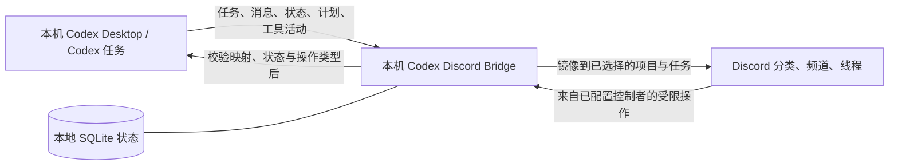
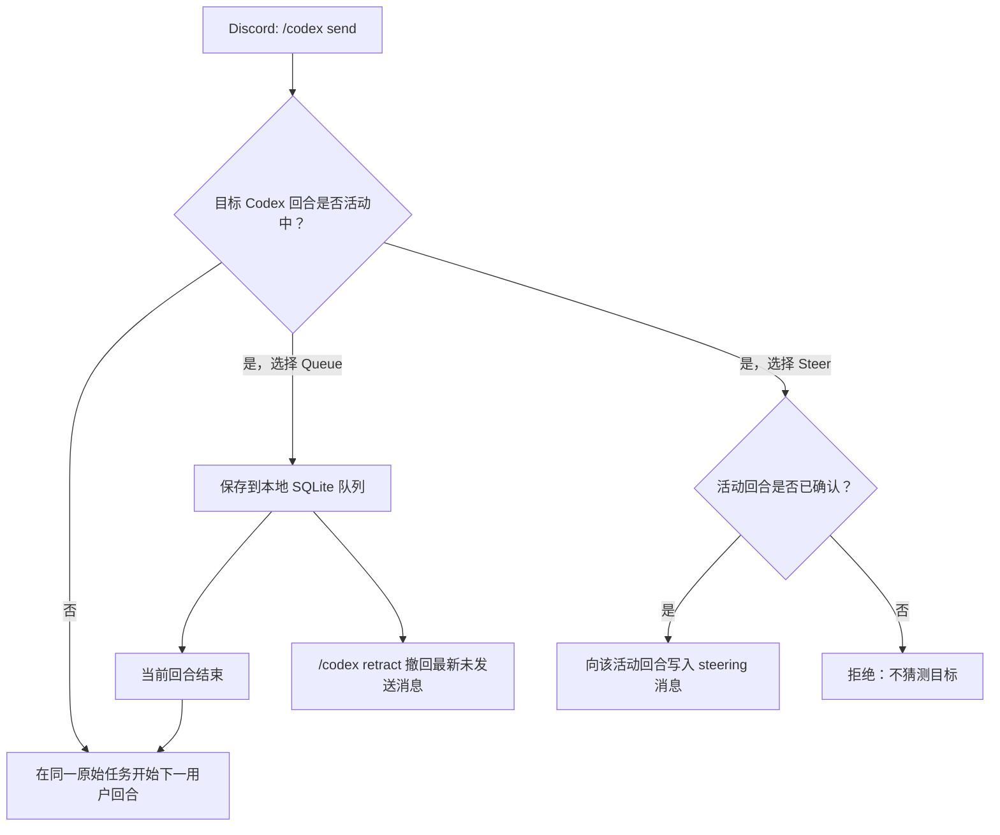

# Codex ↔ Discord 功能档案（首个公开版本草案）

> 状态：待维护者审核。本文件尚未提交或推送。
>
> 本文只描述公开版本的产品能力，不包含任何真实 Discord 服务器、频道、用户、对话、图片、日志、路径或密钥。

需要让 AI 按功能逐项配置、实现和验收时，请同时使用 [AI 功能实施与验收手册](ai-feature-implementation-runbook.zh-CN.md)。

## 一句话说明

Codex Discord Bridge 是一个运行在本机的受控桥接层：它把选中的 Codex 项目和任务活动投射到 Discord，并把经过校验的 Discord 操作写回到**同一个** Codex 任务。

Codex 仍是事实来源和执行端；Discord 是受限的通知与控制界面，不是第二个 Codex，也不会获得任意命令执行能力。

## 项目来源与本版本扩展

上游原版建立了 Codex → Discord 的活动同步基础。本独立维护版本在此基础上增加了受控的 Discord → Codex 同任务直接对话：经授权的控制者可发送新回合消息、排队等待下一回合，或引导已确认的活动回合，使 Codex 继续对话并修改项目。

## 如何阅读“同步”

本文将能力分为三类，避免把“完全同步”误解为全部 Codex 内部能力都能在 Discord 操作：

| 类别 | 含义 |
| --- | --- |
| **镜像同步** | Codex 中已经发生的内容或状态会显示在 Discord。 |
| **受控交互** | Discord 可对已映射的 Codex 任务发起严格限定的操作。 |
| **边界/只读** | 为安全或平台限制，Discord 只展示状态，或该能力不支持。 |

## 总体关系

本地 SQLite 只用于保存桥接的映射、监控选择、队列和短期交互状态，使重启后能恢复正确关联；它不把 Discord 变成 Codex 的数据源。

## Codex 功能与 Discord 对应关系

### 1. 项目、任务与子任务层级

| Codex 中的对象 | Discord 中的呈现 | 类别 | 说明 |
| --- | --- | --- | --- |
| 项目/工作区 | 分类（Category） | 镜像同步 | 仅显示被选择监控的项目。 |
| 顶层任务/对话 | 频道（Channel） | 镜像同步 + 受控交互 | 一个已映射频道对应一个原始 Codex 任务。 |
| 子代理/子任务 | 频道线程（Thread） | 镜像同步 | 在同一任务下保留层级，便于查看子任务活动。 |
| 任务标题与状态 | 频道名称、状态消息 | 镜像同步 | 标题更新会合并处理，避免无意义的频繁改名。 |

### 2. 实时活动镜像

桥接可将下列 Codex 活动显示在相应 Discord 频道或线程中：

- 用户消息、进行中的 commentary 和最终回答；
- 命令执行与结果摘要；
- 文件编辑活动；
- 任务进行中、完成、失败等回合状态；
- Codex 的计划步骤进度；
- 支持的审批请求与可回答的工具输入请求。

这是一种面向移动端查看和受控操作的投射：内容仍在本机 Codex 会话中产生和保存。

### 3. 状态指示灯与任务健康状态

每个已映射的顶层任务频道都会用频道名前缀和状态消息展示当前状态。它不是猜测出来的在线指示，而是由 Codex 回合事件、审批事件和重启恢复状态驱动。

| 指示灯 | 频道前缀 | 含义 | Discord 中的表现 |
| --- | --- | --- | --- |
| 🟡 | `🟡-任务名` | 进行中或正在重连 | 状态消息显示“进行中”或“正在重连”，可附带计划进度。 |
| 🔴 | `🔴-任务名` | 等待授权、网络错误、额度/限流或系统错误 | 状态消息写明已脱敏的原因；需要授权时显示对应的受控审批卡片。 |
| 🟢 | `🟢-任务名` | 已完成或已停止 | 保留最终状态，便于移动端快速确认回合结束。 |
| ⚪ | `⚪-任务名` | 已暂停监控 | 不再投射后续活动，恢复后才继续更新。 |

状态文字会优先附加到最近的 Codex commentary 或最终回答；没有可附加目标时才使用单独的状态消息。频道改名前会做短暂合并，避免高频事件造成改名刷屏；重启后会根据本地桥接状态重新对齐可确认的状态。

### 4. 选择性监控与生命周期管理

| 功能 | Discord 操作/表现 | 类别 |
| --- | --- | --- |
| 选择项目与任务 | `/codex manage` 私有管理面板 | 受控交互 |
| 默认不自动发现全部任务 | 只有明确选择的范围开始镜像 | 安全边界 |
| 暂停镜像 | 保留映射但停止后续同步 | 受控交互 |
| 恢复镜像 | 继续该任务的后续同步 | 受控交互 |
| 清理镜像 | 二次确认后移除 Discord 侧镜像 | 受控交互 |
| 重启后的状态恢复 | 从本地状态重建必要映射和控制面板 | 可靠性能力 |

## 从 Discord 写回 Codex：发送、队列、立即插入

所有写回都只针对已映射的原始 Codex 任务；桥接不会把消息投给不相关任务，也不会创建一个含糊的新会话来代替原会话。

### `/codex send`：发送一条新消息

当目标 Codex 任务当前空闲时，`/codex send` 会在该原始任务中开始一个新的用户回合。这对应正常的 Codex“向当前任务发送下一条消息”。

### Queue：排队发送

当 Codex 正在处理一个回合时，直接开始另一回合可能造成上下文和状态冲突。此时选择 **Queue**：

1. 消息先保存到本机 SQLite 队列；
2. 当前 Codex 回合完成后，桥接把该消息作为同一任务的下一条用户消息发送；
3. `/codex retract` 可以撤回最新一条尚未发送的排队消息。

Queue 对应的是“保持任务顺序的下一回合消息”，**不是**中断正在运行的 Codex。

### Steer（立即插入）：向正在运行的回合发送引导

当桥接已确认目标任务存在一个活动中的 Codex 回合时，**Steer** 会把消息写入这个正在运行的回合，供 Codex 立即接收并调整当前工作方向。

它对应 Codex 的实时 steering（引导）能力，而不是新建回合，也不是任意终止任务。没有已知的活动回合、映射不明确或状态已过期时，桥接会拒绝操作而不是猜测目标。

### 其他写回控制

| Discord 功能 | 对应 Codex 能力 | 约束 |
| --- | --- | --- |
| `/codex send` | 同一任务的下一条用户消息 | 仅已映射频道。 |
| Queue | 同一任务的有序下一回合 | 仅在当前回合后发送。 |
| Steer | 活动回合的实时引导消息 | 必须能确认活动回合。 |
| `/codex retract` | 取消最新未发送的队列项 | 不会撤销已交给 Codex 的消息。 |
| `/codex model` | 设置后续任务回合使用的模型/推理级别 | 受桥接配置和 Codex 可用能力限制。 |
| 普通文本消息（可选） | 等同于受控的发送入口 | 默认只接受一个配置好的 Discord 控制者。 |
| 审批按钮/计划反馈 | 回应对应的 Codex 审批或计划请求 | 仅精确匹配、未过期的请求。 |

## 首个公开版本实现的能力

下面是这次开发周期已经实现并纳入首个公开版本的能力。对公开用户而言，这些是“功能覆盖与可靠性保证”，不应表述为“修复了某个用户的私有问题”。

1. **原任务写回**：Discord 的受控消息、队列和引导会返回同一个 Codex 原始任务，而非创建脱节的新任务。
2. **回合状态生命周期**：将进行中、结束和异常状态以持续状态消息呈现，并把重要状态附加到 Codex commentary。
3. **计划进度镜像**：Codex 的计划步骤能在 Discord 中显示进度。
4. **选择性监控**：以私有控制面板选择项目与任务；默认不扫描和公开所有本地任务。
5. **暂停、恢复和清理**：可管理每个任务的 Discord 镜像生命周期，清理操作要求确认。
6. **子任务线程**：将受支持的子代理活动映射到任务频道的线程。
7. **Unicode 名称支持**：项目和频道名称可以保留中文等 Unicode 字符。
8. **状态一致性保护**：对重复事件、重连、标题更新和控制面板状态做去重与协调，减少重复回显和错误状态。
9. **Discord 图片传给 Codex**：受支持的图片附件会下载到本地临时缓存，并以本地图片路径作为 Codex 输入的一部分。
10. **图片安全限制**：只接受 Discord 官方 CDN 域名、受支持图片扩展名；每条消息最多 4 张、每张最多 8 MiB。
11. **图片缓存 7 天轮转**：本地 Discord 图片缓存会清理超过 7 天的文件，防止长期无限增长。
12. **短期交互保留**：回合、审批和详情等状态会按配置做有限保留并清理过期项目，避免 SQLite 状态无边界累积。
13. **状态指示灯**：频道名前缀和状态消息同步反映进行中、等待授权/错误、完成/停止与暂停监控状态。

## 有意不做或受限的能力

- Discord 不是本机的终端，不能从 Discord 任意执行 shell 命令。
- 不能由任意 Discord 用户控制 Codex；控制者、频道和任务映射均需匹配。
- 不会把所有本地项目、历史对话或子任务默认同步到 Discord。
- 如果 Codex Desktop 尚未暴露对应的原生审批界面，远程子任务审批可能只能显示状态，不能强制替代本地审批。
- 桥接覆盖的是可安全映射的 Codex 功能，不承诺复刻 Codex 的每一个内部界面或未公开能力。

## 无隐私截图的公开演示方案

不应把真实 Discord 截图提交到公开仓库。即使打码，也可能遗留服务器名称、频道结构、头像、时间、文件名、消息语气、通知或图像元数据。

第一版建议直接使用本文的 Mermaid 架构图和队列流程图：它们是可编辑、可审查、零用户数据的“功能截图替代品”。

如果后续需要更直观的视觉素材，建议制作三张**从零生成的示意 UI 图**，并在每张图角落标注“Illustrative mockup / 示例界面，非真实 Discord 截图”：

| 图稿 | 展示重点 | 允许的数据 |
| --- | --- | --- |
| 项目层级 | 项目分类 → 任务频道 → 子任务线程 | 虚构项目 `sample-web`、虚构任务 `Improve search`。 |
| 回合控制 | 运行中任务上的 Queue、Steer、Retract | 虚构控制者 `Controller`，不放用户 ID 或时间。 |
| 监控面板 | 选择、暂停、恢复、清理镜像 | 全部使用示例名称和占位状态。 |

图稿中不得出现真实 Discord 截图、服务器/频道名称、用户名、头像、消息、文件路径、机器信息、日期、ID、令牌、二维码或任何上传过的图片。生成前应先审阅文字和布局，生成后再进行一次静态隐私检查。

## 首个公开版本的清理与发布顺序

发布不是把本机运行目录直接上传。应按照下列顺序处理，并在每一步保留可审核证据：

1. **先保留私有备份**：私有开发仓库的稳定提交和本地运行状态不复制到公开仓库。
2. **建立干净公开工作树**：只保留源代码、测试、示例配置、许可证、归属说明和公开文档；排除 `.env`、数据库、日志、缓存、图片、备份和临时文件。
3. **审查可达 Git 历史**：检查准备推送的分支与标签，而不仅是当前文件；不应含真实对话、Discord 服务器信息、图片或密钥。
4. **扫描敏感内容与大文件**：检查令牌/私钥/Webhook 模式、受忽略敏感文件、二进制媒体和异常大对象。命中项先人工判断，绝不把真实凭据打印进报告。
5. **检查公开文档与演示素材**：只允许 Mermaid 图或完全虚构的示意图；不使用真实截图，即使已经打码。
6. **验证功能**：运行构建、静态检查和测试；真实 Discord 验证只在用户明确授权的私有服务器中进行。
7. **最后再提交与推送**：复查 `git diff`、提交文件清单和远程目标，得到维护者确认后才发布。

本次公开版本应把“清理、隐私审查和受控发布”视为功能交付的一部分，而不是发布后的补救动作。

## 推荐的公开表述

> Codex Discord Bridge mirrors selected live Codex task activity to Discord and routes a small, explicit set of validated controls back to the same local Codex task. It supports viewing, monitored task management, ordered queueing, active-turn steering, supported approvals, and local image handoff—while keeping Codex and sensitive state on your computer.

## 审核清单

- [ ] Queue、Steer 和“发送新回合”的含义符合预期。
- [ ] 功能范围没有夸大为“复刻全部 Codex”。
- [ ] 首个公开版本的功能列表没有写入私有修复细节。
- [ ] 图片方案只使用流程图或完全虚构的示意图。
- [ ] 审核通过后，再决定是否把本文链接到 README、生成示意图并提交推送。
